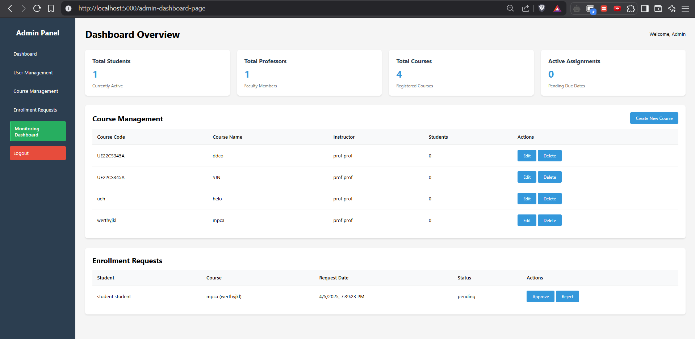

# Application Monitoring Dashboard

This repository contains a comprehensive **Application Monitoring Dashboard** designed for a **University Assignment Portal**. The system integrates **Prometheus**, **Grafana**, **Loki**, and **Kafka** to provide real-time monitoring, logging, and alerting capabilities. It also includes a Flask-based backend for managing users, courses, assignments, and dashboards.

---

## Table of Contents

1. [Features](#features)
2. [Architecture](#architecture)
3. [Technologies Used](#technologies-used)
4. [Setup Instructions](#setup-instructions)
5. [Usage](#usage)
6. [Monitoring Dashboards](#monitoring-dashboards)
7. [API Endpoints](#api-endpoints)
8. [Screenshots](#screenshots)
9. [Contributing](#contributing)
10. [License](#license)

---

## Features

- **User Roles**: Admin, Professor, and Student with role-based access control.
- **Real-Time Monitoring**:
  - API response times (95th percentile, median).
  - Total API request counts.
  - Real-time logs using Loki.
- **Dashboards**:
  - Admin Dashboard: Manage users, courses, and enrollment requests.
  - Professor Dashboard: Manage assignments, grade submissions, and view course details.
  - Student Dashboard: View courses, submit assignments, and track grades.
- **Load Testing**: Simulate user activity using the `load_generator.py` script.
- **Logging**: Centralized logging with Kafka and Loki.
- **Metrics**: Push metrics to Prometheus for visualization in Grafana.

---

## Architecture

The system is built using a **microservices architecture** with the following components:

1. **Flask Backend**:
   - Handles user authentication, role-based dashboards, and API endpoints.
   - Logs API requests and responses to Kafka.

2. **Kafka**:
   - Acts as a message broker for API logs.

3. **Prometheus**:
   - Collects and stores metrics for API performance.

4. **Grafana**:
   - Visualizes metrics and logs in real-time dashboards.

5. **Loki**:
   - Stores and queries logs for debugging and analysis.

6. **Pushgateway**:
   - Pushes custom metrics from the Flask backend to Prometheus.

---

## Technologies Used

- **Backend**: Flask, MySQL
- **Monitoring**: Prometheus, Grafana, Loki
- **Message Broker**: Kafka
- **Frontend**: HTML, CSS, JavaScript (for dashboards)
- **Load Testing**: Python (using `load_generator.py`)

---

## Setup Instructions

### Prerequisites

- Docker and Docker Compose
- Python 3.8+
- MySQL Server

### Steps

1. **Clone the Repository**:
   ```bash
   git clone https://github.com/Arjun-N2603/application-monitoring-dashboard.git
   cd application-monitoring-dashboard
   ```

2. **Set Up MySQL Database**:
   - Create a database named `university_assignment_portal`.
   - Import the schema and data using the provided SQL scripts in the `Queries/` folder.

3. **Configure Environment Variables**:
   - Update `config.py` with your MySQL credentials and other configurations.

4. **Start Services**:
   - Use Docker Compose to start Kafka, Prometheus, Loki, and Grafana:
     ```bash
     docker-compose up -d
     ```

5. **Install Python Dependencies**:
   ```bash
   pip install -r requirements.txt
   ```

6. **Run the Flask Application**:
   ```bash
   python app.py
   ```

7. **Access the Application**:
   - Flask Backend: `http://localhost:5000`
   - Grafana Dashboard: `http://localhost:3000` (Default credentials: `admin/admin`)

---

## Usage

### User Roles

1. **Admin**:
   - Manage users, courses, and enrollment requests.
   - Access the monitoring dashboard.

2. **Professor**:
   - Create assignments, grade submissions, and view course details.

3. **Student**:
   - Enroll in courses, submit assignments, and track grades.

### Load Testing

Run the `load_generator.py` script to simulate user activity:
```bash
python load_generator.py --users 10 --interval 2
```

---

## Screenshots

### Admin Dashboard


### Professor Dashboard
*(Add screenshot here)*

### Student Dashboard
*(Add screenshot here)*

### Grafana Dashboard
*(Add screenshot here)*

---

